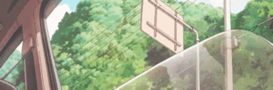
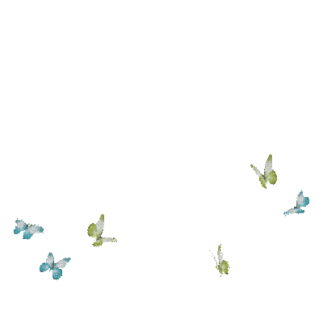
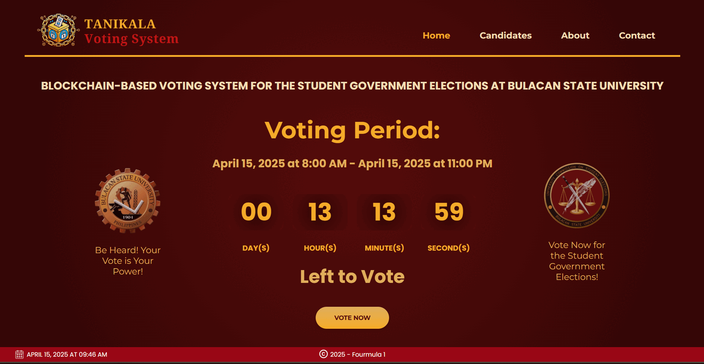

  

  

## 🌷🍃 About Me 

🎓 BS Mathematics graduate with a specialization in Computer Science   
💡 Enjoys building creative and practical solutions to real-world problems    
🌐 Specializes in web design and development  
🎨 Passionate about UI/UX design   
📱 Interested in app development     
🔗 My personal site is under construction  
📫 Contact me at <a href="mailto:dungo.zr@gmail.com">dungo.zr@gmail.com</a>

  
## 🌼☁️ Skills & Tools 

  

     
     
    
         
     
    
     
      
    
     
     
        
    
    
    
      
    
    
  

  
## 🪻🫧 Most Notable Project  

 <strong> TANIKALA: A Blockchain-Based Voting System </strong> 

  

