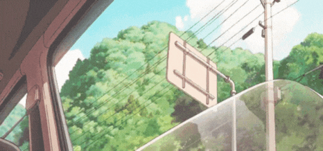
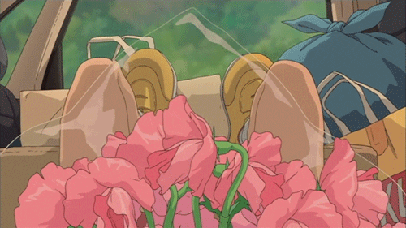

<h2> Hey, it's me, Zari!</h2>

I am currently working on my personal website. 
## About Me

<table>
  <tr>
    <td valign="top" style="width:50%;">
🎓 BS Mathematics graduate with a specialization in Computer Science  
💡 Enjoys building creative and practical solutions to real-world problems  
🌐 Passionate about web development  
Intereseted in app development  
🎨 Loves UI/UX design  

    </td>
    <td valign="top">
      
    </td>
  </tr>
  </table>

  <table>
  <tr>
  <td valign="top">

  ## Project Preview
  
  </td>
  <td valign="top">

 ## Skills
  </td>
  </tr>
  </table>

<table>
<tr>
<td valign="top">

</td>
<td valign="top">

</td>
</tr>
</table>

<!--  -->

